# DFRM - Systemarkitektur

## 🏗️ Övergripande Arkitektur

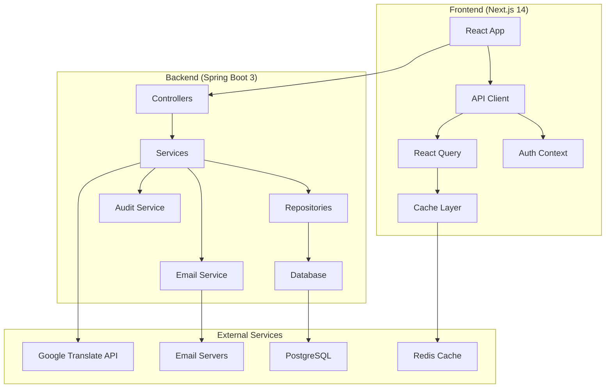

## 🔐 Säkerhetsarkitektur

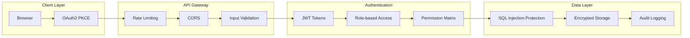

## 📊 Databasarkitektur

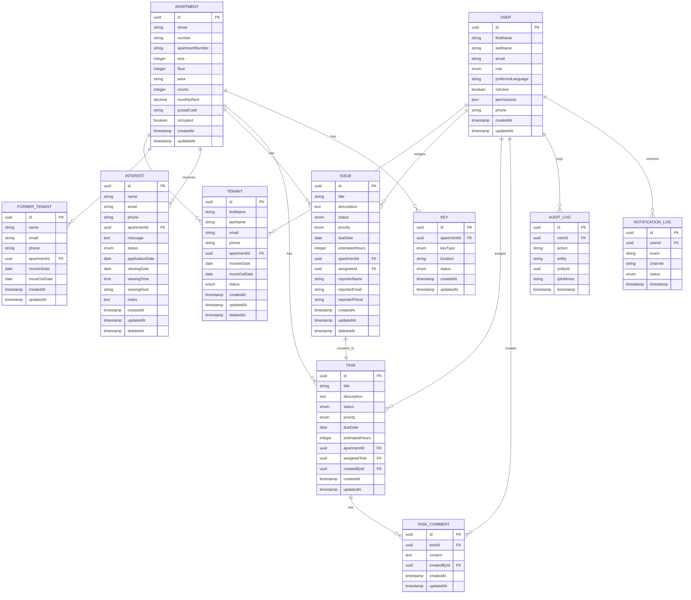

## 🔄 Dataflöde

### Hyresgästhantering
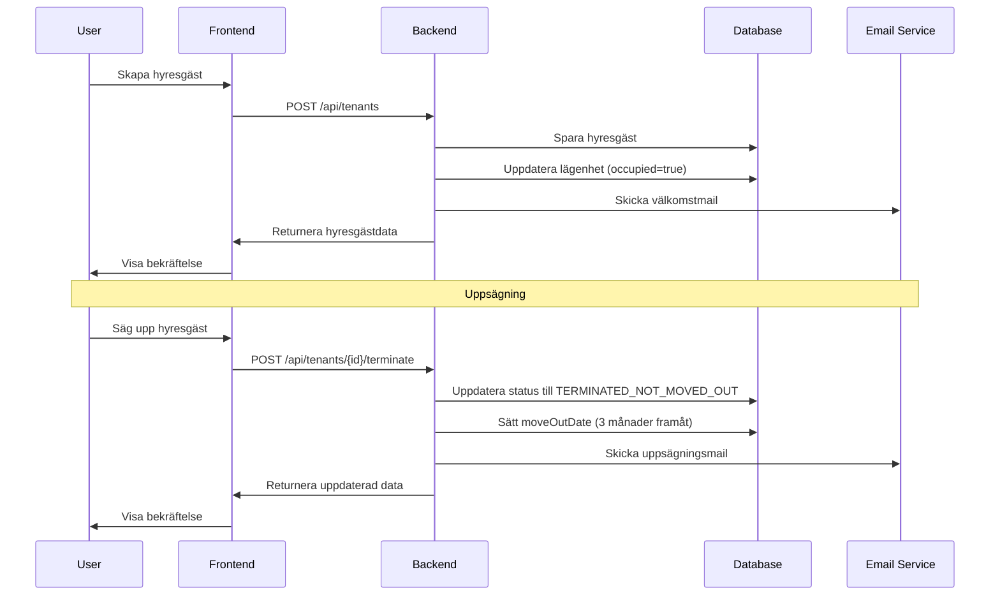

### Felanmälningsflöde
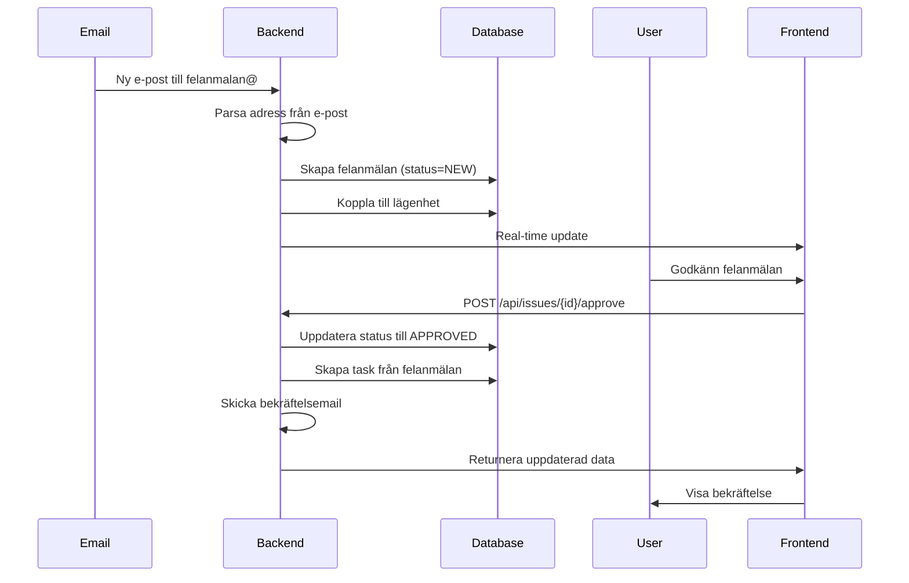

### Intresseanmälningsflöde
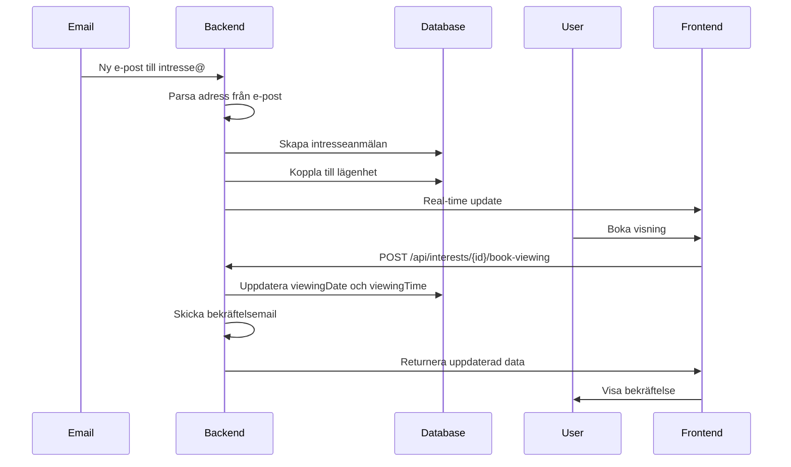

## 🎯 Komponentarkitektur

### Frontend-komponenter
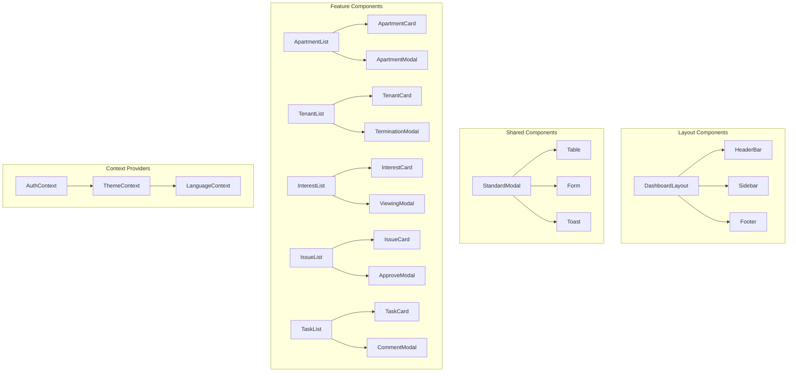

### Backend-lager
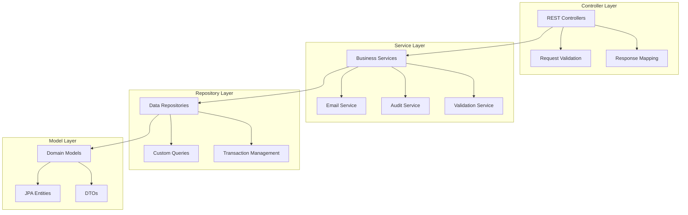

## 🔧 Teknisk Stack Detaljer

### Frontend Stack
- **Next.js 14**: App Router, Server Components
- **TypeScript 5.0+**: Strict mode, explicit typing
- **Tailwind CSS**: Utility-first styling
- **shadcn/ui**: Komponentbibliotek
- **React Query**: Server state management
- **React Hook Form**: Formulärhantering
- **Zod**: Schema validation

### Backend Stack
- **Spring Boot 3**: Framework
- **Java 17**: LTS version
- **Spring Security**: Autentisering och auktorisering
- **Spring Data JPA**: Databasåtkomst
- **Hibernate**: ORM
- **Flyway**: Databasmigrationer
- **JavaMail**: E-posthantering

### Databas och Cache
- **PostgreSQL 14+**: Primärdatabas
- **Redis**: Caching och session storage
- **UUID**: Primärnycklar
- **Soft Delete**: deleted_at för känsliga entiteter

### Deployment och DevOps
- **Vercel**: Frontend hosting
- **Render.com**: Backend hosting
- **GitHub Actions**: CI/CD
- **Docker**: Containerisering (valfritt)

## 📊 Performance-arkitektur

### Caching-strategi
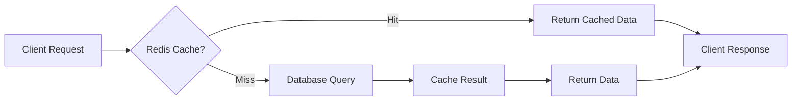

### Database-optimering
- **Indexes**: Strategiska indexes för sökningar
- **Connection Pooling**: HikariCP
- **Query Optimization**: N+1 problem prevention
- **Partitioning**: För stora tabeller (framtida)

### Frontend-optimering
- **Code Splitting**: Lazy loading av komponenter
- **Bundle Optimization**: Tree shaking
- **Image Optimization**: Next.js Image component
- **CDN**: Vercel Edge Network

## 🔒 Säkerhetsarkitektur

### Autentisering
- **OAuth2 PKCE**: Authorization Code Flow
- **JWT Tokens**: Rotatable refresh tokens
- **HttpOnly Cookies**: Säker token storage
- **Session Management**: Timeout och re-auth

### Autorisering
- **Role-based Access Control**: USER, ADMIN, SUPERADMIN
- **Permission Matrix**: Granular behörigheter
- **API Security**: CORS, Rate limiting
- **Input Validation**: Strikt validering

### Dataskydd
- **Encryption**: At rest och in transit
- **Audit Logging**: Alla känsliga operationer
- **Data Sanitization**: Input och output encoding
- **Vulnerability Scanning**: Automatisk säkerhetsskanning

## 📈 Monitoring och Logging

### Logging-strategi
- **Structured Logging**: JSON-format
- **Log Levels**: ERROR, WARN, INFO, DEBUG
- **Centralized Logging**: Samlad logghantering
- **Performance Monitoring**: Response times

### Health Checks
- **Database Connectivity**: Databasanslutning
- **External Services**: E-post, API-nycklar
- **Memory Usage**: JVM heap monitoring
- **Response Times**: API performance

## 🚀 Deployment-arkitektur

### Miljöer
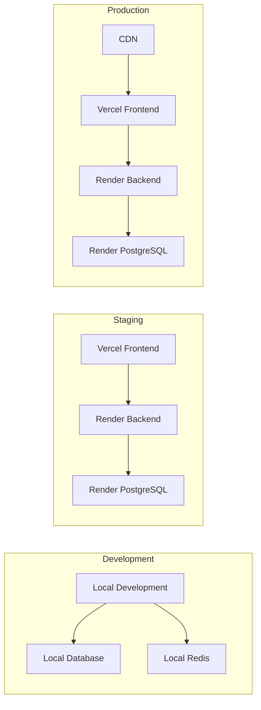

### CI/CD Pipeline
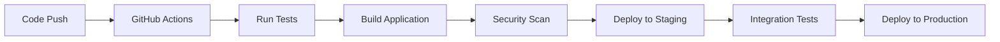

---

**Senaste uppdatering**: 2024-12-19  
**Version**: 4.1.0  
**Status**: Under utveckling 