# DFRM - Systemarkitektur

## 🏗️ Övergripande Arkitektur


## 🔐 Säkerhetsarkitektur


## 📊 API-arkitektur (Implementerad)

```mermaid
graph TB
    subgraph "Controllers (6 st) ✅"
        A1[UserController]
        A2[ApartmentController]
        A3[TenantController]
        A4[InterestController]
        A5[IssueController]
        A6[TaskController]
    end
    
    subgraph "Services (6 st) ✅"
        B1[UserService]
        B2[ApartmentService]
        B3[TenantService]
        B4[InterestService]
        B5[IssueService]
        B6[TaskService]
    end
    
    subgraph "Repositories (6 st) ✅"
        C1[UserRepository]
        C2[ApartmentRepository]
        C3[TenantRepository]
        C4[InterestRepository]
        C5[IssueRepository]
        C6[TaskRepository]
    end
    
    subgraph "Models (6 st) ✅"
        D1[User]
        D2[Apartment]
        D3[Tenant]
        D4[Interest]
        D5[Issue]
        D6[Task]
    end
    
    A1 --> B1
    A2 --> B2
    A3 --> B3
    A4 --> B4
    A5 --> B5
    A6 --> B6
    
    B1 --> C1
    B2 --> C2
    B3 --> C3
    B4 --> C4
    B5 --> C5
    B6 --> C6
    
    C1 --> D1
    C2 --> D2
    C3 --> D3
    C4 --> D4
    C5 --> D5
    C6 --> D6
```



## 📊 Databasarkitektur

```mermaid
erDiagram
    USER {
        uuid id PK
        string firstName
        string lastName
        string email
        enum role "USER, ADMIN, SUPERADMIN"
        string preferredLanguage "sv, en, bg, pl, sq, uk"
        boolean isActive
        string permissions "JSON array"
        string phone
        timestamp createdAt
        timestamp updatedAt
    }
    
    APARTMENT {
        uuid id PK
        string street
        string number
        string apartmentNumber
        integer size "m²"
        integer floor
        string area
        integer rooms
        decimal monthlyRent "precision 10, scale 2"
        string postalCode
        boolean occupied
        timestamp createdAt
        timestamp updatedAt
    }
    
    TENANT {
        uuid id PK
        string firstName
        string lastName
        string email
        string phone
        string personalNumber
        uuid apartmentId FK
        date moveInDate
        date moveOutDate
        decimal monthlyRent "precision 10, scale 2"
        enum status "ACTIVE, TERMINATED, TERMINATED_NOT_MOVED_OUT"
        string terminationReason
        date terminationDate
        timestamp createdAt
        timestamp updatedAt
    }
    
    INTEREST {
        uuid id PK
        string firstName
        string lastName
        string email
        string phone
        uuid apartmentId FK
        enum status "PENDING, CONFIRMED, REJECTED"
        date viewingDate
        string viewingTime
        boolean viewingConfirmed
        boolean viewingEmailSent
        timestamp viewingEmailSentDate
        text notes
        timestamp createdAt
        timestamp updatedAt
    }
    
    ISSUE {
        uuid id PK
        string firstName
        string lastName
        string email
        string phone
        uuid apartmentId FK
        string subject
        text description
        enum priority "LOW, MEDIUM, HIGH, URGENT"
        enum status "NEW, APPROVED, REJECTED"
        date approvedDate
        date rejectedDate
        string rejectionReason
        boolean emailSent
        timestamp emailSentDate
        timestamp createdAt
        timestamp updatedAt
    }
    
    TASK {
        uuid id PK
        string title
        text description
        uuid apartmentId FK
        uuid assignedUserId FK
        enum priority "LOW, MEDIUM, HIGH, URGENT"
        enum status "PENDING, IN_PROGRESS, COMPLETED, CANCELLED, ON_HOLD"
        timestamp dueDate
        timestamp completedDate
        double estimatedHours
        double actualHours
        double cost "precision 10, scale 2"
        boolean emailSent
        timestamp emailSentDate
        timestamp createdAt
        timestamp updatedAt
        timestamp deletedAt "soft delete"
    }
    
    USER ||--o{ TASK : "assigned to"
    APARTMENT ||--o{ TENANT : "has"
    APARTMENT ||--o{ INTEREST : "interested in"
    APARTMENT ||--o{ ISSUE : "reported for"
    APARTMENT ||--o{ TASK : "related to"
```



## 📋 Datatyper och Enum-värden

### Primära datatyper
- **UUID**: Alla primärnycklar och foreign keys
- **String**: Namn, e-post, telefon, adresser, beskrivningar
- **Integer**: Storlek, våning, rum, antal
- **BigDecimal**: Monetära värden (precision 10, scale 2)
- **Boolean**: Status-fält, flaggor
- **LocalDate**: Datum utan tid (inflyttning, utflyttning, visning)
- **LocalDateTime**: Datum med tid (skapande, uppdatering, förfallodatum)
- **Double**: Timmar, kostnader (precision 10, scale 2)

### Enum-värden

#### UserRole
- `USER` - Vanlig användare
- `ADMIN` - Administratör
- `SUPERADMIN` - Superadministratör

#### TenantStatus
- `ACTIVE` - Aktiv hyresgäst
- `TERMINATED` - Avslutad kontrakt
- `TERMINATED_NOT_MOVED_OUT` - Avslutad men inte utflyttad

#### InterestStatus
- `PENDING` - Väntande intresseanmälan
- `CONFIRMED` - Bekräftad intresseanmälan
- `REJECTED` - Avvisad intresseanmälan

#### IssuePriority
- `LOW` - Låg prioritet
- `MEDIUM` - Medel prioritet
- `HIGH` - Hög prioritet
- `URGENT` - Akut prioritet

#### IssueStatus
- `NEW` - Ny felanmälan
- `APPROVED` - Godkänd felanmälan
- `REJECTED` - Avvisad felanmälan

#### TaskPriority
- `LOW` - Låg prioritet
- `MEDIUM` - Medel prioritet
- `HIGH` - Hög prioritet
- `URGENT` - Akut prioritet

#### TaskStatus
- `PENDING` - Väntande uppgift
- `IN_PROGRESS` - Pågående uppgift
- `COMPLETED` - Slutförd uppgift
- `CANCELLED` - Avbruten uppgift
- `ON_HOLD` - Pausad uppgift

### Språkkoder
- `sv` - Svenska
- `en` - Engelska
- `bg` - Bulgariska
- `pl` - Polska
- `sq` - Albanska
- `uk` - Ukrainska

## 🚀 Implementation Status

### ✅ Slutförda komponenter (Backend)
- **Modeller**: 6/6 (100%) - User, Apartment, Tenant, Interest, Issue, Task
- **Repositories**: 6/6 (100%) - Alla med omfattande sökmetoder
- **Services**: 6/6 (100%) - Alla med business logic
- **Controllers**: 6/6 (100%) - Alla REST endpoints implementerade
- **Databas**: 100% - PostgreSQL-migrationer med indexes
- **Kompilering**: ✅ - Alla 25 Java-filer kompilerar utan fel

### 🔄 Pågående utveckling
- **Säkerhetskonfiguration**: 0% - OAuth2 med PKCE
- **Frontend**: 0% - Next.js 14 med TypeScript
- **Autentisering**: 0% - JWT-token hantering

### 📊 Teknisk status
- **Backend**: 95% komplett
- **Frontend**: 0% komplett
- **Databas**: 100% komplett
- **API**: 100% komplett

### 🎯 Nästa steg
1. **Säkerhetskonfiguration** (Prioritet 1)
   - OAuth2 med PKCE implementation
   - JWT-token hantering
   - Role-based access control
   - CORS-konfiguration

2. **Frontend-implementation** (Prioritet 2)
   - Next.js 14 setup
   - shadcn/ui komponenter
   - React Query integration
   - OAuth2-autentisering

3. **Testing och Deployment** (Prioritet 3)
   - Unit-tester
   - Integration-tester
   - CI/CD pipeline
   - Produktionsdeployment
```
        string lastName
        string email
        string phone
        uuid apartmentId FK
        date moveInDate
        date moveOutDate
        enum status
        timestamp createdAt
        timestamp updatedAt
        timestamp deletedAt
    }
    
    FORMER_TENANT {
        uuid id PK
        string name
        string email
        string phone
        uuid apartmentId FK
        date moveInDate
        date moveOutDate
        timestamp createdAt
        timestamp updatedAt
    }
    
    INTEREST {
        uuid id PK
        string name
        string email
        string phone
        uuid apartmentId FK
        text message
        enum status
        date applicationDate
        date viewingDate
        time viewingTime
        string viewingHost
        text notes
        timestamp createdAt
        timestamp updatedAt
        timestamp deletedAt
    }
    
    ISSUE {
        uuid id PK
        string title
        text description
        enum status
        enum priority
        date dueDate
        integer estimatedHours
        uuid apartmentId FK
        uuid assigneeId FK
        string reporterName
        string reporterEmail
        string reporterPhone
        timestamp createdAt
        timestamp updatedAt
        timestamp deletedAt
    }
    
    TASK {
        uuid id PK
        string title
        text description
        enum status
        enum priority
        date dueDate
        integer estimatedHours
        uuid apartmentId FK
        uuid assignedToId FK
        uuid createdById FK
        timestamp createdAt
        timestamp updatedAt
    }
    
    TASK_COMMENT {
        uuid id PK
        uuid taskId FK
        text content
        uuid createdById FK
        timestamp createdAt
        timestamp updatedAt
    }
    
    KEY {
        uuid id PK
        uuid apartmentId FK
        enum keyType
        string location
        enum status
        timestamp createdAt
        timestamp updatedAt
    }
    
    AUDIT_LOG {
        uuid id PK
        uuid userId FK
        string action
        string entity
        uuid entityId
        string ipAddress
        timestamp timestamp
    }
    
    NOTIFICATION_LOG {
        uuid id PK
        uuid userId FK
        string event
        string channel
        enum status
        timestamp timestamp
    }
    
    APARTMENT ||--o{ TENANT : "has"
    APARTMENT ||--o{ FORMER_TENANT : "had"
    APARTMENT ||--o{ INTEREST : "receives"
    APARTMENT ||--o{ ISSUE : "has"
    APARTMENT ||--o{ TASK : "has"
    APARTMENT ||--o{ KEY : "has"
    USER ||--o{ TENANT : "assigns"
    USER ||--o{ ISSUE : "assigns"
    USER ||--o{ TASK : "assigns"
    USER ||--o{ TASK_COMMENT : "creates"
    USER ||--o{ AUDIT_LOG : "logs"
    USER ||--o{ NOTIFICATION_LOG : "receives"
    TASK ||--o{ TASK_COMMENT : "has"
    ISSUE ||--|| TASK : "converts_to"
```

## 🔄 Dataflöde

### Hyresgästhantering

```mermaid
sequenceDiagram
    participant U as User
    participant F as Frontend
    participant B as Backend
    participant D as Database
    participant E as Email Service
    
    U->>F: Skapa hyresgäst
    F->>B: POST /api/tenants
    B->>D: Spara hyresgäst
    B->>D: Uppdatera lägenhet (occupied=true)
    B->>E: Skicka välkomstmail
    B->>F: Returnera hyresgästdata
    F->>U: Visa bekräftelse
    
    Note over U,E: Uppsägning
    U->>F: Säg upp hyresgäst
    F->>B: POST /api/tenants/{id}/terminate
    B->>D: Uppdatera status till TERMINATED_NOT_MOVED_OUT
    B->>D: Sätt moveOutDate (3 månader framåt)
    B->>E: Skicka uppsägningsmail
    B->>F: Returnera uppdaterad data
    F->>U: Visa bekräftelse
```


### Felanmälningsflöde

```mermaid
sequenceDiagram
    participant E as Email
    participant B as Backend
    participant D as Database
    participant U as User
    participant F as Frontend
    
    E->>B: Ny e-post till felanmalan@
    B->>B: Parsa adress från e-post
    B->>D: Skapa felanmälan (status=NEW)
    B->>D: Koppla till lägenhet
    B->>F: Real-time update
    
    U->>F: Godkänn felanmälan
    F->>B: POST /api/issues/{id}/approve
    B->>D: Uppdatera status till APPROVED
    B->>D: Skapa task från felanmälan
    B->>B: Skicka bekräftelsemail
    B->>F: Returnera uppdaterad data
    F->>U: Visa bekräftelse
```


### Intresseanmälningsflöde


## 🎯 Komponentarkitektur

### Frontend-komponenter


### Backend-lager


## 🔧 Teknisk Stack Detaljer

### Frontend Stack
- **Next.js 14**: App Router, Server Components
- **TypeScript 5.0+**: Strict mode, explicit typing
- **Tailwind CSS**: Utility-first styling
- **shadcn/ui**: Komponentbibliotek
- **React Query**: Server state management
- **React Hook Form**: Formulärhantering
- **Zod**: Schema validation

### Backend Stack
- **Spring Boot 3**: Framework
- **Java 17**: LTS version
- **Spring Security**: Autentisering och auktorisering
- **Spring Data JPA**: Databasåtkomst
- **Hibernate**: ORM
- **Flyway**: Databasmigrationer
- **JavaMail**: E-posthantering

### Databas och Cache
- **PostgreSQL 14+**: Primärdatabas
- **Redis**: Caching och session storage
- **UUID**: Primärnycklar
- **Soft Delete**: deleted_at för känsliga entiteter

### Deployment och DevOps
- **Vercel**: Frontend hosting
- **Render.com**: Backend hosting
- **GitHub Actions**: CI/CD
- **Docker**: Containerisering (valfritt)

## 📊 Performance-arkitektur

### Caching-strategi


### Database-optimering
- **Indexes**: Strategiska indexes för sökningar
- **Connection Pooling**: HikariCP
- **Query Optimization**: N+1 problem prevention
- **Partitioning**: För stora tabeller (framtida)

### Frontend-optimering
- **Code Splitting**: Lazy loading av komponenter
- **Bundle Optimization**: Tree shaking
- **Image Optimization**: Next.js Image component
- **CDN**: Vercel Edge Network

## 🔒 Säkerhetsarkitektur

### Autentisering
- **OAuth2 PKCE**: Authorization Code Flow
- **JWT Tokens**: Rotatable refresh tokens
- **HttpOnly Cookies**: Säker token storage
- **Session Management**: Timeout och re-auth

### Autorisering
- **Role-based Access Control**: USER, ADMIN, SUPERADMIN
- **Permission Matrix**: Granular behörigheter
- **API Security**: CORS, Rate limiting
- **Input Validation**: Strikt validering

### Dataskydd
- **Encryption**: At rest och in transit
- **Audit Logging**: Alla känsliga operationer
- **Data Sanitization**: Input och output encoding
- **Vulnerability Scanning**: Automatisk säkerhetsskanning

## 📈 Monitoring och Logging

### Logging-strategi
- **Structured Logging**: JSON-format
- **Log Levels**: ERROR, WARN, INFO, DEBUG
- **Centralized Logging**: Samlad logghantering
- **Performance Monitoring**: Response times

### Health Checks
- **Database Connectivity**: Databasanslutning
- **External Services**: E-post, API-nycklar
- **Memory Usage**: JVM heap monitoring
- **Response Times**: API performance

## 🚀 Deployment-arkitektur

### Miljöer


### CI/CD Pipeline


---

**Senaste uppdatering**: 2024-12-19  
**Version**: 4.1.0  
**Status**: Under utveckling 